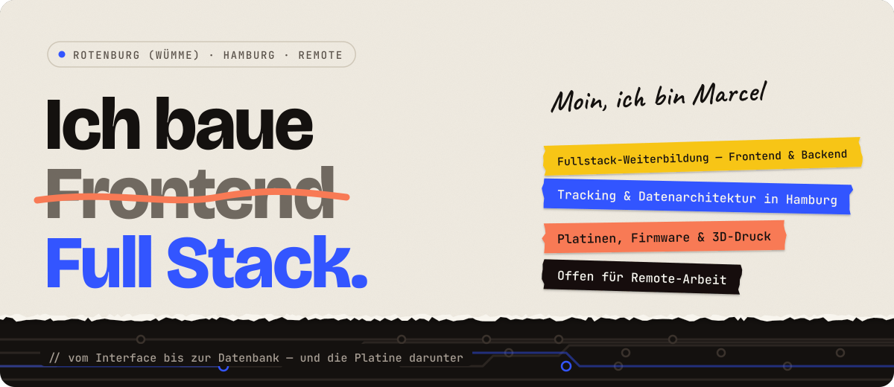

<a href="https://marcelhaessler.de">
  <picture>
    <source media="(prefers-color-scheme: dark)" srcset="assets/header-de-dark.svg">
    
  </picture>
</a>

  <a href="https://marcelhaessler.de"><b>marcelhaessler.de</b></a> ·
  <a href="https://www.linkedin.com/in/marcel-h%C3%A4%C3%9Fler">LinkedIn</a> ·
  <a href="mailto:moin@marcelhaessler.de">moin@marcelhaessler.de</a> ·
  <a href="README.md">English</a>

---

Zehn Jahre habe ich Digitalisierungsprojekte bei der Deutschen Bahn geleitet. Danach habe ich datenschutzgerecht ausgelegte Datenarchitekturen für einen Großkonzern und einen Konzern aus der Immobilienbranche gebaut. Jetzt schreibe ich den Code selbst, **vom Interface bis zur Datenbank**. Und wenn es sein muss, auch die Platine darunter.

### Drei Ebenen, eine Person

| Frontend | Backend | Daten & Datenschutz |
| :-- | :-- | :-- |
| Interfaces, die auf jedem Gerät funktionieren und ohne Erklärung verständlich sind. Sauberes Markup, zugängliche Komponenten, ein Framework nur da, wo es trägt. | APIs mit Django REST Framework, Datenmodelle, Authentifizierung und Rechte, Deployment. | Meine Nische: Daten so erheben und bewegen, dass sie verlässlich sind *und* rechtlich tragen. Technisch gelöst, nicht wegdiskutiert. |
| `JavaScript` `TypeScript` `Angular` `HTML & CSS` `Accessibility` | `Python` `Django REST Framework` `Node.js` `PostgreSQL` `Redis` `Docker` | `DSGVO` `Privacy by Design` `Consent Management` `Server-side Tracking` `Dashboards` |

### Über den Stack hinaus

- **Hardware.** C++ auf ESP32 und Arduino, Schaltpläne und geroutete Platinen in KiCad, Bauteile konstruiert und im 3D-Druck gefertigt.
- **Automatisierung.** n8n-Workflows, KI-Agenten mit eigenen Skills, Home Assistant. Ich finde die Stelle, an der ein Prozess klemmt, und baue sie weg, statt sie zu dokumentieren.
- **Projekt & Prozess.** Über zehn Jahre Projektverantwortung, zertifiziert in Project Facilitation, agil aus der täglichen Arbeit. Ich kann das Ticket selbst schreiben und sage rechtzeitig, wenn ein Zeitplan nicht aufgeht.

### Ausgewählte Arbeiten

| Projekt | Was es zeigt | Links |
| :-- | :-- | :-- |
| **Besucherstrom-Analyse per BLE** | ESP32-Knoten mit eigener Platine und gedrucktem Gehäuse, Server mit Zeitreihen je Zone, pseudonymisiert by Design | [Projektseite](https://marcelhaessler.de/#projekte) · Repo folgt |
| **[Videoflix](https://github.com/MarcelHaessler/backend.Videoflix)** | Video-Plattform-API: HLS-Konvertierung in 3 Auflösungen als Hintergrundjob, JWT in HttpOnly-Cookies, komplett in Docker, 49 Tests bei 99 % Coverage | [Code](https://github.com/MarcelHaessler/backend.Videoflix) |
| **[Coderr](https://github.com/MarcelHaessler/Coderr)** | Marktplatz-API mit zwei Rollen, drei Preisstufen je Angebot und Bestellungen als unveränderliche Kopie | [Live](https://coderr.marcelhaessler.de/) · [Projektseite](https://marcelhaessler.de/coderr_portfolio.html) · [Code](https://github.com/MarcelHaessler/Coderr) |
| **[Quizly](https://github.com/MarcelHaessler/backend.Quizly)** | YouTube-Video → lokale Whisper-Transkription → Gemini mit Response-Schema → Quiz. Transkribiert wird lokal, ans LLM geht nur der Text. | [Code](https://github.com/MarcelHaessler/backend.Quizly) |
| **[KanMind](https://github.com/MarcelHaessler/KanMind)** | Team-Boards, Aufgaben und Kommentare mit Rechten pro Objekt und Mitglied | [Code](https://github.com/MarcelHaessler/KanMind) |
| **[Join](https://github.com/MarcelHaessler/Join)** | Kanban-Board im Team: Drag & Drop ohne Bibliothek, responsive bis 320 px | [Live](https://join.marcelhaessler.de/) · [Projektseite](https://marcelhaessler.de/join_portfolio.html) · [Code](https://github.com/MarcelHaessler/Join) |
| **[PollApp](https://github.com/MarcelHaessler/PollApp)** | Angular 21 + Supabase: Live-Ergebnisse, Row-Level-Security, abstimmen ohne Konto | [Code](https://github.com/MarcelHaessler/PollApp) |
| **[Kangaroo Riot](https://github.com/MarcelHaessler/kangaroo_riot)** | 2D-Jump-and-Run im Canvas: Game-Loop, Kollisionen und Spielzustand selbst geschrieben, ohne Engine | [Spielen](https://kangurooroit.marcelhaessler.de/) · [Projektseite](https://marcelhaessler.de/kangaroo_portfolio.html) · [Code](https://github.com/MarcelHaessler/kangaroo_riot) |

### Worauf ich beim Bauen achte

- **Weniger erheben.** Am billigsten zu schützen sind Daten, die nie gespeichert wurden. Früh pseudonymisieren, Temp-Dateien sofort löschen, Fehlermeldungen so vage halten, dass niemand nach Konten suchen kann.
- **Geheimnisse gehören nicht in JavaScript.** Tokens liegen in HttpOnly-Cookies, Schlüssel bleiben auf dem Server.
- **Vergangenes bleibt vergangen.** Eine Bestellung behält die vereinbarten Konditionen, auch wenn sich das Angebot später ändert.
- **Erst Tests, dann „fertig“.** Rechte- und Validierungsregeln bekommen eigene Tests, nicht nur der Happy Path.

Rotenburg (Wümme) · Hamburg · offen für Remote-Arbeit · <a href="https://marcelhaessler.de/#kontakt">Lass uns reden</a>

