<a href="https://marcelhaessler.de">
  <picture>
    <source media="(prefers-color-scheme: dark)" srcset="assets/header-en-dark.svg">
    
  </picture>
</a>

  <a href="https://marcelhaessler.de"><b>marcelhaessler.de</b></a> ·
  <a href="https://www.linkedin.com/in/marcel-h%C3%A4%C3%9Fler">LinkedIn</a> ·
  <a href="mailto:moin@marcelhaessler.de">moin@marcelhaessler.de</a> ·
  <a href="README.de.md">Deutsch</a>

---

I spent ten years leading digitalisation projects at Deutsche Bahn. After that I built privacy-compliant data architectures for a large corporation and a real-estate group. Now I write the code myself, **from the interface down to the database**. And if it has to be, I design the circuit board underneath as well.

### Three layers, one person

| Frontend | Backend | Data & privacy |
| :-- | :-- | :-- |
| Interfaces that work on every device and need no explanation. Clean markup, accessible components, a framework only where it pays off. | APIs with Django REST Framework, data models, authentication and permissions, deployment. | My niche: collecting and moving data so it is reliable *and* holds up legally. Solved in code, not argued away. |
| `JavaScript` `TypeScript` `Angular` `HTML & CSS` `Accessibility` | `Python` `Django REST Framework` `Node.js` `PostgreSQL` `Redis` `Docker` | `GDPR` `Privacy by design` `Consent management` `Server-side tracking` `Dashboards` |

### Beyond the stack

- **Hardware.** C++ on ESP32 and Arduino, schematics and routed PCBs in KiCad, parts designed and 3D printed.
- **Automation.** n8n workflows, AI agents with custom skills, Home Assistant. When a process is stuck, I remove the bottleneck rather than writing it up.
- **Project & process.** 10+ years of project ownership, certified in Project Facilitation, agile from daily practice. I can write the ticket myself, and I say early when a schedule won't hold.

### Selected work

| Project | What it shows | Links |
| :-- | :-- | :-- |
| **People-flow analysis via BLE** | ESP32 nodes with their own PCB and printed case, a server with time series per zone, pseudonymised by design | [Case study](https://marcelhaessler.de/#projekte) · repo coming soon |
| **[Videoflix](https://github.com/MarcelHaessler/backend.Videoflix)** | Video platform API: HLS transcoding in 3 resolutions as background jobs, JWT in HttpOnly cookies, fully dockerised, 49 tests at 99 % coverage | [Code](https://github.com/MarcelHaessler/backend.Videoflix) |
| **[Coderr](https://github.com/MarcelHaessler/Coderr)** | Marketplace API with two roles, three price tiers per offer and orders stored as immutable snapshots | [Live](https://coderr.marcelhaessler.de/) · [Case study](https://marcelhaessler.de/coderr_portfolio.html) · [Code](https://github.com/MarcelHaessler/Coderr) |
| **[Quizly](https://github.com/MarcelHaessler/backend.Quizly)** | YouTube video → local Whisper transcription → Gemini with a response schema → quiz. Transcription runs locally, only the text goes to the LLM. | [Code](https://github.com/MarcelHaessler/backend.Quizly) |
| **[KanMind](https://github.com/MarcelHaessler/KanMind)** | Team boards, tasks and comments with object-level permissions per member | [Code](https://github.com/MarcelHaessler/KanMind) |
| **[Join](https://github.com/MarcelHaessler/Join)** | Kanban board built as a team: drag & drop without a library, responsive down to 320 px | [Live](https://join.marcelhaessler.de/) · [Case study](https://marcelhaessler.de/join_portfolio.html) · [Code](https://github.com/MarcelHaessler/Join) |
| **[PollApp](https://github.com/MarcelHaessler/PollApp)** | Angular 21 + Supabase: realtime results, row-level security, voting without an account | [Code](https://github.com/MarcelHaessler/PollApp) |
| **[Kangaroo Riot](https://github.com/MarcelHaessler/kangaroo_riot)** | 2D jump 'n' run on canvas: game loop, collisions and state written by hand, no engine | [Play](https://kangurooroit.marcelhaessler.de/) · [Case study](https://marcelhaessler.de/kangaroo_portfolio.html) · [Code](https://github.com/MarcelHaessler/kangaroo_riot) |

### What I care about when I build

- **Collect less.** The cheapest data to protect is the data you never stored. Pseudonymise early, delete temp files right away, keep error messages vague enough that nobody can probe for accounts.
- **Keep secrets away from JavaScript.** Tokens go into HttpOnly cookies, keys stay on the server.
- **History stays history.** An order keeps the terms that were agreed, even if the offer changes later.
- **Tests before anything is "done".** Permission and validation rules get tests of their own, not just the happy path.

Rotenburg (Wümme) · Hamburg · open to remote work · <a href="https://marcelhaessler.de/#kontakt">Let's talk</a>

